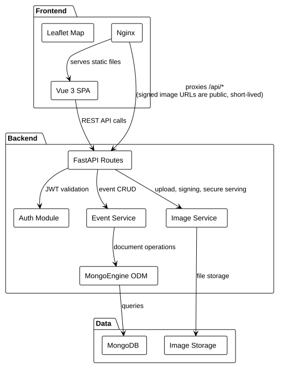
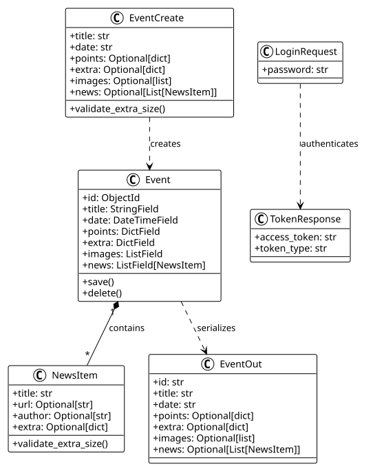
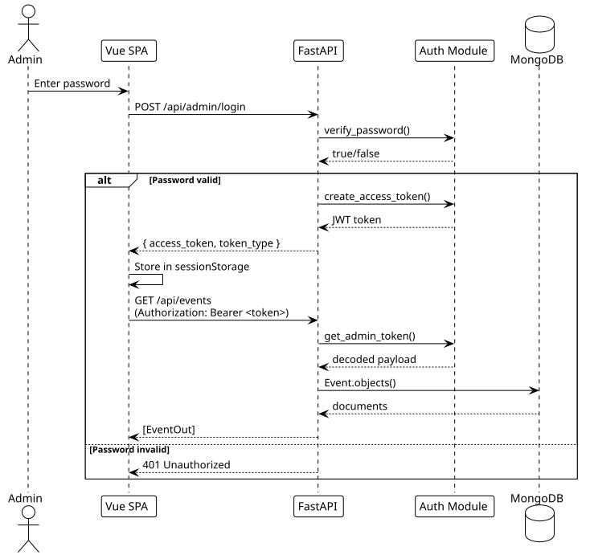
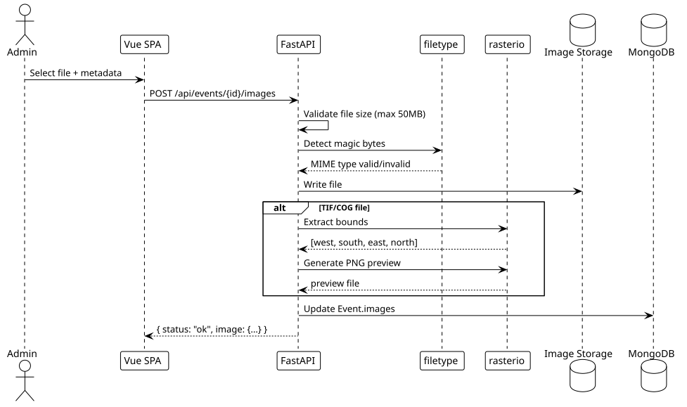

# Resonate2

A map-based event management application with satellite imagery support. Built with FastAPI, MongoDB, and Vue.js.

## Getting Started

### Prerequisites

- Python 3.12+
- Node.js 20+
- Docker & Docker Compose

### Installation

```bash
# Clone the repository
git clone git@github.com:SimWalther/resonate2.git
cd resonate2

# Install Python dependencies
uv sync

# Install frontend dependencies
cd frontend && npm install && cd ..
```

### Environment Setup

Copy `.env.example` to `.env` and set your secrets:

```bash
cp .env.example .env
# Edit .env with your secure passwords
```

### Running with Docker (Recommended)

```bash
docker compose up --build
```

- Frontend: http://localhost
- API: http://localhost:8000
- MongoDB: mongodb://localhost:27017 (internal only)

### Running Locally (Development)

```bash
# Terminal 1: API
uv run uvicorn main:app --reload

# Terminal 2: Frontend
cd frontend && npm run dev
```

## Architecture Overview



## Component Diagram



## Authentication Flow



## Image Upload Flow



## API Documentation

### Endpoints

| Endpoint | Method | Auth | Description |
|----------|--------|------|-------------|
| `/api/admin/login` | POST | None | Login, returns JWT |
| `/api/events` | GET | JWT | List all events |
| `/api/events` | POST | JWT | Create event |
| `/api/events/{id}` | GET | JWT | Get single event |
| `/api/events/{id}` | PUT | JWT | Update event |
| `/api/events/{id}` | DELETE | JWT | Delete event |
| `/api/events/{id}/images` | POST | JWT | Upload image |
| `/api/events/{id}/images` | GET | JWT | List images |
| `/api/public/events` | GET | None | Public read-only |

### Event Schema

```json
{
  "id": "string",
  "title": "string",
  "date": "ISO 8601 datetime",
  "points": {
    "type": "MultiPoint",
    "coordinates": [[lat, lng], ...]
  },
  "extra": {
    "key": "value"
  },
  "images": [
    {
      "filename": "string",
      "name": "string",
      "image_type": "optical|sar|elevation",
      "bounds": [west, south, east, north],
      "preview": "filename_preview.png"
    }
  ]
}
```

### Upload Validation

- **Allowed types**: PNG, JPEG, TIFF (detected by magic bytes)
- **Max size**: 50MB
- **TIFF processing**: Automatic bounds extraction and PNG preview generation

## Project Structure

```
resonate2/
├── main.py              # FastAPI application & routes
├── auth.py              # JWT & password utilities
├── pyproject.toml       # Python dependencies
├── docker-compose.yml   # Docker services
├── Dockerfile           # API container
├── .env.example         # Environment template
├── tests/
│   ├── conftest.py      # Test fixtures
│   └── test_events.py   # API tests (19 tests)
├── docs/
│   └── diagrams/
│       ├── *.puml       # PlantUML source files
│       ├── *.svg        # Rendered diagrams
│       └── render.py    # Render script
└── frontend/
    ├── src/
    │   └── views/
    │       ├── Home.vue     # Public map + timeline
    │       └── Admin.vue    # Event management
    ├── nginx.conf        # Reverse proxy config
    └── Dockerfile        # Frontend container
```

## Regenerating Diagrams

```bash
uv run python docs/diagrams/render.py
```

This uses the public PlantUML server to render SVGs from `.puml` files.

## Development Workflow

See `AGENTS.md` for the complete development process.

### Quick Start

```bash
# Run tests
uv run pytest tests/ -v

# Build frontend
cd frontend && npm run build

# Start development
docker compose up --build
```